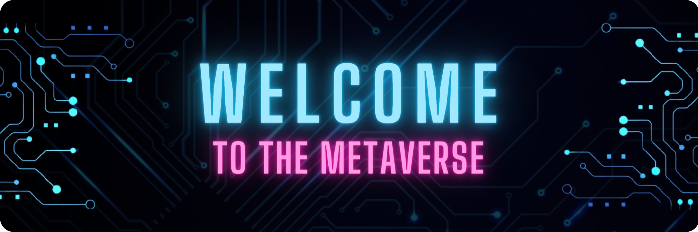
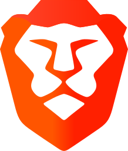
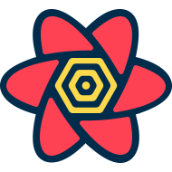

  

 

## Hi there 👋

✨ I'm Paul. Frontend Architect, Web Developer, Consultant and Crypto Enthusiast from Taipei (Taiwan).

### 🌟 I'm currently working on

  <a href="https://github.com/PSheon/Media-Gallery-Frontend" target="_blank" rel="noreferrer noopener">
    <picture>
      <source
        media="(prefers-color-scheme: dark)" srcset="https://github-readme-stats.vercel.app/api/pin/?username=PSheon&repo=Media-Gallery-Frontend&theme=dracula&hide_border=true"
      />
      
    </picture>
  </a>

---

### 🍹 Statistics & Achievements

  <picture>
    <source
      media="(prefers-color-scheme: dark)" srcset="https://github-readme-stats.vercel.app/api/top-langs/?username=psheon&layout=compact&theme=dracula&hide_border=true&langs_count=4&hide[]=javascript&hide[]=html&hide[]=arduino"
    />
    <source
      media="(prefers-color-scheme: light), (prefers-color-scheme: no-preference)" srcset="https://github-readme-stats.vercel.app/api/top-langs/?username=psheon&layout=compact&title_color=ff6e96&icon_color=79dafa&hide=javascript,html,arduino&langs_count=4"
    />
    
  </picture>
  <picture>
    <source
      media="(prefers-color-scheme: dark)" srcset="https://github-readme-stats.vercel.app/api?username=psheon&theme=dracula&hide_border=true&show_icons=true&hide=contribs"
    />
    <source
      media="(prefers-color-scheme: light), (prefers-color-scheme: no-preference)" srcset="https://github-readme-stats.vercel.app/api?username=psheon&title_color=ff6e96&icon_color=79dafa&show_icons=true&hide=contribs"
    />
    
  </picture>

### 🐧 Connect with me

 
 

### 🔥 Languages and Skills

