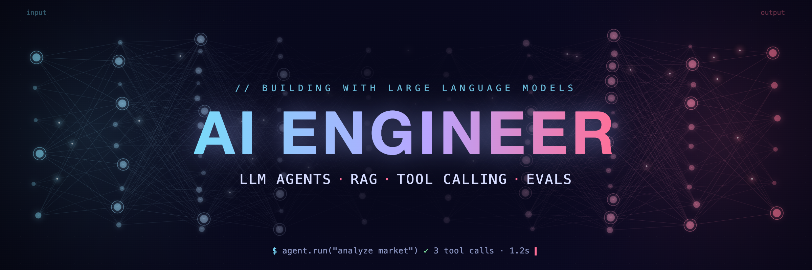
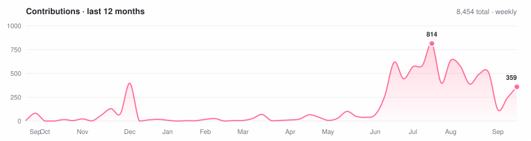

  

  

  
  

## Hi there 👋

I'm **Paul**. I build machines that see and agents that act, and I like to own the whole path: the perception model on the edge device, the tracks and events it produces, and the agents that decide what to do with them.

- 👁 **Computer vision** — multi-task perception networks, teacher / student distillation, ONNX / TensorRT on Jetson
- 🤝 **Multi-agent systems** — orchestrator / worker designs, MCP tool contracts, edge-and-cloud split
- 🧠 **LLM** — multimodal document understanding, structured output, VLMs on trigger rather than on every frame
- ⚡ **Edge** — RTSP ingest, GStreamer, WebRTC, Rust and Kotlin Multiplatform where Python is too slow
- 📍 Kaohsiung, Taiwan · building at [Syncrobotic](https://syncrobotic.ai/)

## 🔭 What I'm building

### [HydraNet](https://github.com/Syncrobotic/SyncAI-Lib-HydraNet) — one camera, one model, everything in metres

Left: detections and tracks with a staff / customer verdict. Right: the same moment in metres, with the live dwell field on the floor.

- **One ~8M-parameter network, one forward pass.** A shared RegNetX-800MF + BiFPN trunk carrying detection (`person`, `bag`, `device`, `boxed_stock`), pose (17 keypoints decoded inside the boxes) and terrain segmentation (`floor`, `wall`, `column`, `fixture`, `person`).
- **Teachers once, student every frame.** SAM 3, Grounding DINO, Depth-Anything V2 and ViTPose run once per camera to label and to fit the scene geometry. Anything constant on a fixed camera is cached, never learned. Only what changes frame to frame spends the GPU.
- **Tracks in metres, not pixels.** Boxes become floor positions through the cached geometry, so dwell, paths and queues come out in real units. Exported to ONNX / TensorRT for Jetson Orin, budgeted at 96 streams × 5 fps.

<table>
  <tr>
    <td width="50%" valign="top">
      <h3>🧠 LLM</h3>
      
<a href="https://github.com/PSheon/PDF2Markdown"><b>PDF2Markdown</b></a> — multimodal LLM transcription of PDFs and images into clean Markdown: tables, formulas and diagrams preserved. Gemini-powered, model-swappable.

      
In HydraNet the VLM is a <i>trigger</i>, not a per-frame cost: rules and a tiny temporal model raise events, the VLM explains them.

    </td>
    <td width="50%" valign="top">
      <h3>🤝 Multi-Agent</h3>
      
<b>Omnie agent orchestrator</b> — an orchestrator / worker design split across edge and cloud: perception workers stay on the device next to the camera, planning and retrieval run where the big models live, MCP defines the tool contract between them.

      
Private for now. Architecture notes coming.

    </td>
  </tr>
  <tr>
    <td width="50%" valign="top">
      <h3>👁 Computer Vision</h3>
      
<a href="https://github.com/Syncrobotic/SyncAI-Lib-HydraNet"><b>HydraNet</b></a> — the multi-task perception network above, plus the commissioning pipeline (<code>syncai_bev3d</code>) that turns one static plate into a metric 3D scene, walkable floor, shelf ROIs and false-positive polygons per camera.

    </td>
    <td width="50%" valign="top">
      <h3>⚡ Edge</h3>
      
<a href="https://github.com/Syncrobotic/SyncAI-Data-RtspRecorder"><b>RtspRecorder</b></a> — multi-stream RTSP recording in Rust: auto-segment, reconnect, cross-day schedules, MKV → MP4, upload to GCS.

      
<a href="https://github.com/Syncrobotic/SyncAI-Lib-KmpWebRTC"><b>KmpWebRTC</b></a> — Kotlin Multiplatform WebRTC SDK with HTTP signaling and per-direction media control, zero WebRTC boilerplate.

    </td>
  </tr>
</table>

## 🧰 Stack

<table>
  <tr><td><b>Vision</b></td><td>     </td></tr>
  <tr><td><b>LLM / Agents</b></td><td>    </td></tr>
  <tr><td><b>Edge / Infra</b></td><td>       </td></tr>
  <tr><td><b>Also</b></td><td>  </td></tr>
</table>

## 📈 Stats

  <picture>
    <source media="(prefers-color-scheme: dark)" srcset="https://github-profile-summary-cards.vercel.app/api/cards/stats?username=psheon&theme=dracula" />
    
  </picture>
  &nbsp;
  <picture>
    <source media="(prefers-color-scheme: dark)" srcset="https://streak-stats.demolab.com/?user=psheon&theme=dracula&hide_border=true&ring=ff6e96&fire=ff6e96&currStreakLabel=79dafa" />
    
  </picture>

  <picture>
    <source media="(prefers-color-scheme: dark)" srcset="./assets/images/contributions-dark.svg" />
    
  </picture>

## 🤝 Find me

  
  

